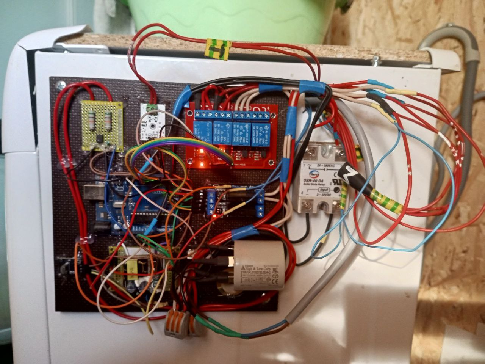
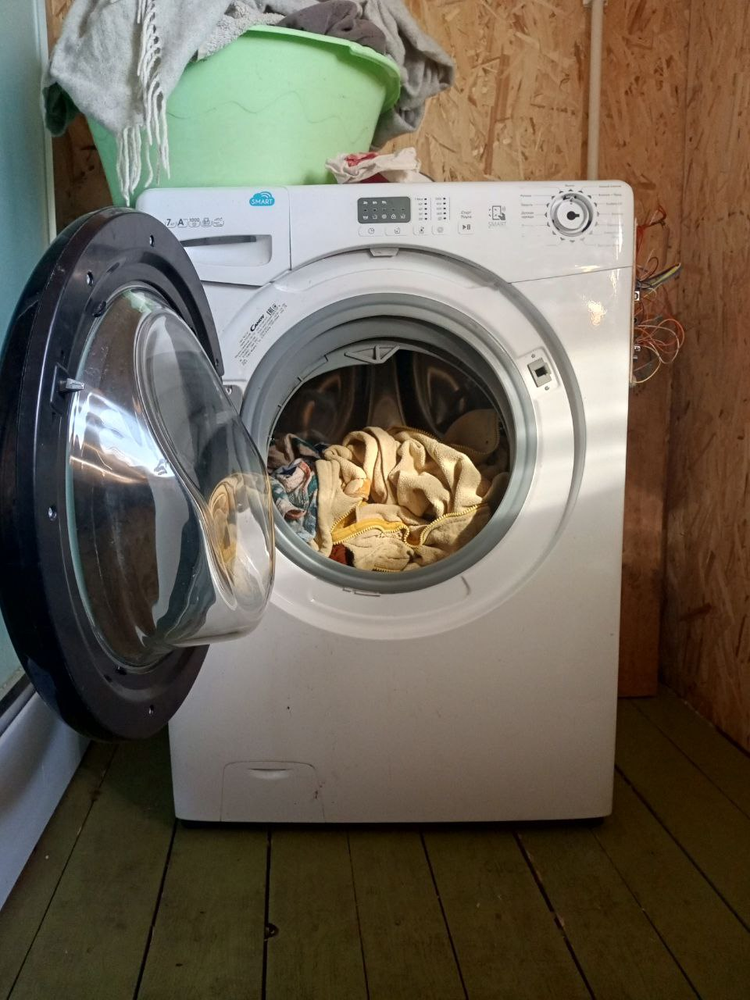

# ofwm

### Ozadchanka free washing machine 

Проект родился вынужденно, так как у меня сломалась заводская стиральная машина, а денег на покупку новой или ремонт старой - не было. К тому же к работе старой машине у меня была масса претензий. Не знаю, все ли заводские стиралки такие, но те, которыми я когда-либо владел имели большие проблемы со стиркой больших загрузок (больше пол-барабана) а так же их отжимом. И вот, сама судьба заставила меня увлечься данной проблемой. Так как живу я в глухих пердях со спутниковым интернетом, то магазинов с радиодеталями у меня в доступе нет, однако имелось пара полураздербаненных ардуино стартерпаков, которых мне с лихвой хватило для реализации изделие. В настоящий момент оно находится в процессе совершенствования, но машина уже стирает. Мне удалось решить вопрос стирки очень больших загрузок и их безопасного отжима. Теперь можно не бояться, что стиралка разрушит твой дом, если ты за ней не углядишь.

Изделие совместимо с любыми стиральными машинами начала ХХ1 века с барабаном, коллекторным двигателем и импульсным прессостатом с незначительными переделками донора (отпазгать разъемы с кос).

Описывать все процессы не буду, заострю внимание лишь на моменте отжима. В самом деле, основная масса моих трудозатрат пришлась именно на этот процесс, а вернее, на то, что предваряет раскрутку барабана до высокой скорости. В общем, с расколбасом стиральной сталкивался каждый пользователь дешевой стиралки. Особенно он неприятен, если пол санузла не обладает достаточной жесткостью, и речь пойдет именно об этом. Наверняка, задачу было бы проще всего решить акселерометром, но у меня его не было, и мне пришлось прибегнуть к другому способу. Полагаю, что и в заводских мозгах происходит как раз что-то такое. 

Итак, расколбас - это следствие эксцентриситета барабана. Происходит такое из-за неравномерного распределения тряпок по внутренней поверхности барабана. У стиральной машины нет ни глаз, ни ручек, поэтому данное явление можно отследить по тахогенератору. Сбалансированный барабан крутится легко и быстро, несбалансированный - медленно. Скорость эксцентричного барабана меняется волнами. Не берусь здесь судить о механике процесса, и возможна мои выводы ошибочны, но это вполне работет. В итоге наша задача сводится к отслеживанию этих колебаний скорости и на основании их размера принимать решение о том, стоит ли разгонять такой барабан вообще.

Для этого нужно максимально равномерно раскидать загрузку по поверхности. Тут я тоже не буду пускаться в долгие рассуждения, опишу как это сделано у меня. В барабанном узле обязательно надо оставить некоторое количество воды, так чтобы нижняя часть барабана касалась ее повехности. С одной стороны это не дает барабану слишком скоро разгоняться, а с другой - придает всему узлу дополнительной массы, которая позволяет стабилизировать его на тестовом участке разгона. 

Первый тест заключается в том, что при помощи пид регулятора мы просто пытаемся разогнать барабан до некой небольшой (безопасной) скорости, и через некоторое время смотрим, действительно ли барабан до нее разогнался. Если нет, то он, определенно, имеет слишком высокий дисбаланс и дальше продолжать не стоит - сразу идем на очередную попытку. Однако, если все прошло успешно,то мы разгоняем барабан еще чуточку и теперь смотрим биения. Измерений делается достаточно много, весь процесс вы можете увидеть в коде. Если биения не превышают допустимых пределов, то барабан ускоряется еще немного и серия измерений проводится снова. Если опять все в порядке, то значит с загрузкой все ок, и дальше можно крутить на полную мощность. Лично моя стиралка, изначально Канди, при таком подходе стала стирать столь тихо, что теперь я даже и не слышу ее через деревянную стенку. 

Теперь опишу процесс стирки в том виде, в котором он реализован сейчас. Пользовательский интерфейс пока полон глюков.
1. Загружаем машину, закрываем дверь. Для начала стирки нужно нажать кнопку "1". Машина подребует подверждения - в течение 5 секунд нажать "ОК".
2. Машина проверит массу загрузки, поиграв барабаном, а потом нальет соответствующее количество воды. Начнется стирка.
3. Стирку в любой момент можно поставить на паузу "ОК". В этом состоянии нажатием "*" вода доливается, а "#" - убавляется. "0" сбросит программу, а ">" - пропустит шаг (начнется отжим, затем машина перейдет к следующему этапу стирки). Количество воды запоминается на всю стирку и после отжимов вода заливается до этого же уровня. Кроме того, когда машина стирает, вы можете отрегулировать скорость работы барабана кнопками "вверх" и "вниз" - установка так же будет запомнена до конца стирки. Скорость вращения барабана влияет на интенсивность стирки. Чем больше дубасят плицы барабана в тряпки, тем мощнее выходит грязь. Однако, из-за этого мотор может перегреться, и тогда стирка удлиннится на технологическую паузу (см ниже).
4. После этапа стирки машина начинает отжим. Делается 10 попыток, и если ни одна из них не увенчалась успехом, то машина встает на паузу и ждет дальнейших указаний. "ОК" снова запустит отжим, ">" пропустит шаг.

**ВНИМАНИЕ**
Моторчики стиральных машин как правило имеют встроенную термозащиту. Иногда, при слишком тяжелых загрузках мотор может перегреваться. Тогда срабатывает теплозащита и мотор перестает крутить. В таком случае машина делает перекур 20 минут, после которого продолжает работу.

Для сборки контроллера требуется следующее:
1. Ардуино уно
2. SSR40-DA (Двигатель диммируется по алгоритму Брезенхема)
3. Блок 2 твердотельных реле
4. Блок 4 электромагнитных реле
5. Делитель напряжения (измерять напряжение с таходатчика)
6. Детектор нуля (PC814 и 2 резистора 50кОм 1Вт)
7. Энкодер ПДУ

У внимательного читателя наверно уже вертится в голове вопрос, о том, где же ТЭН. Он не используется, так как я предпочитаю кинетическое воздействие непосредственно на тряпки, чем нагрев окружающего пространства и септика. Ну а теперь надо бы нарисовать схему и прецепить какие-нибудь картинки...
